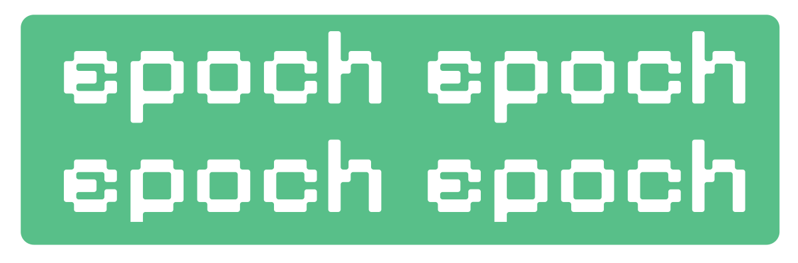

<p align="center">
  
</p>

<p align="center">
  <strong>The terminal-native home for training runs.</strong>
</p>

<p align="center">
  Monitor live runs, inspect system health and compare experiments —
  all from the terminal or over SSH.
</p>

<p align="center">
  
  
  
  
  
</p>

---

<p align="center">
  
</p>

---

## Quick start

```bash
git clone https://github.com/GranneJanne/epoch.git
cd epoch
cargo install --path .

epoch

# watch a log file
epoch train.log

# or pipe directly from a training script
python train.py 2>&1 | epoch --stdin
```

## Why epoch

Training still feels fragmented when you live in logs, tmux, and SSH.

You tail raw output in one pane, watch GPU stats in another, guess whether loss is healthy, and lose context between runs. Browser-first tools can help, but they often feel far away from the actual training loop.

`epoch` is built to be the place you stay during training: standalone, local-first, fast, SSH-friendly, and useful from anywhere on the machine.

## What it does

`epoch` is built for the during-training experience.

It helps you:

- monitor live loss, learning rate, throughput, steps, and timeline history
- inspect GPU, VRAM, CPU, and memory usage alongside training
- keep track of remote jobs over SSH
- pipe output from ad hoc scripts without changing your workflow
- launch inside a project, point at a log, or let it discover likely runs

In short, `epoch` sits between raw training output and actual understanding.

## Supported inputs

`epoch` currently works with common training log styles, including JSONL, CSV, regex-parsed logs, and Hugging Face `trainer_state.json`.

Example JSONL:

```json
{ "loss": 0.53, "step": 120, "lr": 1e-4 }
```

Example CSV:

```csv
step,loss,lr
120,0.53,0.0001
```

## Keybindings

| Key                 | Action                                                                                    |
| ------------------- | ----------------------------------------------------------------------------------------- |
| `q` / `Ctrl+C`      | Quit                                                                                      |
| `Tab` / `Shift+Tab` | Cycle focused Home panel or Run Detail graph                                              |
| `1-4`               | Focus Home panel (Overview/Runs/Processes/Alerts) or Run Detail graph (Loss/Eval/LR/Grad) |
| `Enter`             | Drill into focused run or attach selected process                                         |
| `/`                 | Search runs (when Runs panel is focused)                                                  |
| `f`                 | Cycle run status filter (when Runs panel is focused)                                      |
| `r`                 | Refresh run/process data                                                                  |
| `Space`             | Toggle live/pause viewport follow (Run Detail)                                            |
| `Left/Right`        | Pan active graph history (Run Detail)                                                     |
| `- / =`             | Zoom active graph out/in (Run Detail)                                                     |
| `g`                 | Reset all viewports to live (Run Detail)                                                  |
| `s`                 | Open settings                                                                             |
| `?`                 | Toggle help overlay                                                                       |

With `keymap_profile = "vim"`, motion keys (`h/j/k/l`) are enabled in monitoring surfaces; with the default keymap, arrow keys are used for movement.

## Configuration

`epoch` uses layered TOML configuration.

```
~/.config/epoch/config.toml
```

Optional project-local override:

```
<project>/.epoch/config.toml
```

Effective precedence:

1. Built-in defaults
2. Global config (`~/.config/epoch/config.toml`)
3. Project config (`.epoch/config.toml`)
4. CLI flags

Example:

```toml
tick_rate_ms = 100
parser = "auto"
theme = "system"           # classic | catppuccin | github | nord | gruvbox | solarized | dracula | system | custom
graph_mode = "line"        # sparkline | line
adaptive_layout = true
pinned_metrics = ["tokens_per_second"]
hidden_metrics = []
keymap_profile = "vim"     # default | vim
profile_target = "project" # global | project
run_comparison_file = "baseline.jsonl"

[[alert_rules]]
kind = "throughput_drop"
warning = 200.0
critical = 120.0
enabled = true
cooldown_secs = 30
evaluation = "rolling"
window = 10

[custom_theme]
header_bg = "#1e1e2e"
accent = "#89b4fa"
```

## Contributing

Contributions are welcome. Start here: [Contributing guide](./CONTRIBUTING.md)

High-leverage areas right now:

- parsers and framework integrations
- run discovery and process attach
- comparison workflows
- terminal UX and interaction design
- model visualization

## License

MIT
